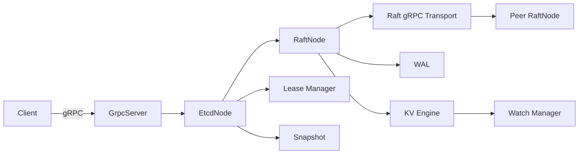

# C++ etcd MVP 概要设计（SDD 视角）

本文描述当前 C++ etcd MVP 的总体架构、模块职责、关键流程与数据格式。

## 1. 架构总览



## 2. 模块划分与职责

| 模块 | 主要职责 | 关键接口 |
|---|---|---|
| GrpcServer | gRPC API 接入 | KV/Watch/Txn/Lease/Cluster/Raft 服务 |
| EtcdNode | 组装运行时依赖 | 初始化 WAL/Snapshot/KV/Watch/Lease/Raft |
| RaftNode | 选举、日志复制、提交 | Propose, OnAppendEntries, OnRequestVote |
| GrpcRaftTransport | 跨进程 RPC | SendAppendEntries, SendRequestVote |
| WalFile | WAL 写入与回放 | Append, Load, PurgeUpTo, SaveHardState |
| SnapshotFile | 快照读写 | Save, Load |
| KvEngine | 状态机与 MVCC | Apply, Put, Get, Delete, Snapshot |
| WatchManager | 事件订阅与历史 | Register, OnEvent, GetHistory, SaveHistory |
| LeaseManager | 租约与过期 | Grant, KeepAlive, Revoke, Expire |

## 3. 关键流程

### 3.1 写入流程（Put/Delete/Txn/Lease）

1. 客户端请求进入 GrpcServer
2. 非 leader 直接返回 NOT_LEADER + leader_address
3. leader 将请求编码为 Raft entry，写入 WAL
4. Raft AppendEntries 复制到多数节点
5. 提交后 Raft Apply 调用 KvEngine/LeaseManager
6. KV 触发 Watch 事件分发

### 3.2 读取流程（Get/Txn Compare）

- 仅 leader 提供读取
- KvEngine 提供 MVCC 元信息

### 3.3 Watch 流程

1. 客户端发起 WatchCreate
2. 若 start_revision 小于历史最早 revision，返回 HISTORY_UNAVAILABLE + compact_revision
3. 回放历史事件
4. 注册 watcher，后续新事件实时推送

### 3.4 Lease 流程

- LeaseGrant/KeepAlive/Revoke 通过 Raft 日志复制
- Lease 到期由 leader 触发 DEL 命令再复制

## 4. 数据与存储格式

### 4.1 WAL

```
term:uint64 | index:uint64 | type:uint8 | length:uint32 | checksum:uint32 | payload
```

- 轮转阈值：`wal_segment_size`
- 写入可配置 `fsync_on_write`

### 4.2 Snapshot

```
apply_index:uint64 | last_term:uint64 | kv_count:uint64 | (klen,vlen,key,val)* | metadata_len:uint64 | metadata_json
```

- 采用临时文件 + 原子重命名
- 成功后清理 apply_index 之前的 WAL 段

### 4.3 Watch 历史

- 内存队列存储最近 N 条事件
- 快照时写入 `watch_history.bin`，启动时加载

## 5. Raft 关键状态

- `HardState`: current_term, voted_for, commit_index
- `LogEntry`: index, term, command
- `next_index`/`match_index` 追踪 follower 复制进度

## 6. 并发模型

- Raft 内部线程：周期 Tick + heartbeats
- gRPC 线程池处理客户端请求
- Watch 回调通过队列 + 条件变量转发

## 7. 错误码与恢复

- WAL: WAL_IO_ERROR, WAL_CORRUPT
- Snapshot: SNAPSHOT_NOT_FOUND, SNAPSHOT_IO_ERROR, SNAPSHOT_CORRUPT
- 客户端: NOT_LEADER, HISTORY_UNAVAILABLE, INTERNAL

## 8. 与上游 etcd 的差距

- 未实现 TLS/mTLS、认证与 RBAC
- 未实现动态成员变更与 joint consensus
- 未实现 read-index/lease read 优化
- MVCC 仅保留单 key 版本链，未做 compaction 对历史版本裁剪
- gRPC API 为子集，不包含完整 etcd v3 语义
